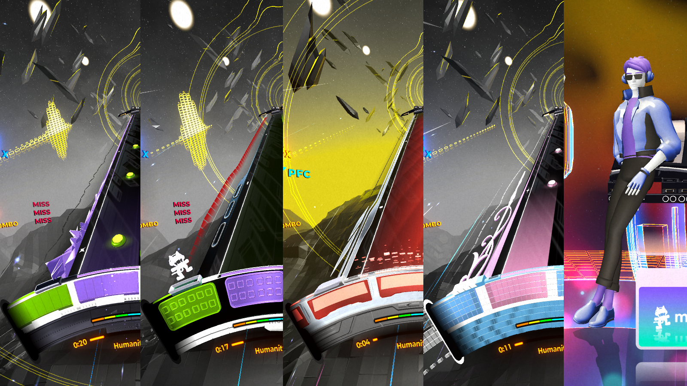

# CustomMatcaps
**Replace various matcap textures used in Spin Rhythm XD.**

Parts of the game currently modifiable:
- Wheel frames
- Wheel "wedge" walls/background
- Track edges/strips *(using the White material)*
- All character/mascot material slots (7)

All DLC content is also supported.

## Dependencies
- SpinCore

## Configuration
All matcap textures/images are stored in `[Spin Rhythm folder]/BepInEx/config/CustomMatcaps` and are referenced by relative/local filenames (including file extensions) in the added Mod Settings menu. Loaded images are cached until a game restart; images added into the configuration folder after the game starts do not require a restart to use.

Changes are applied immediately across any skin/theme/customization/etc. changes.

------

*[big huge list of matcap textures](https://github.com/nidorx/matcaps) (no but like really you probably need this) (the 256px sized ones are enough :smile:)*